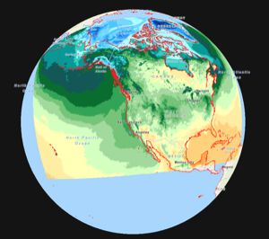
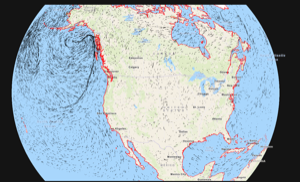
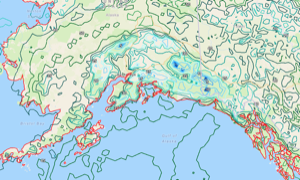
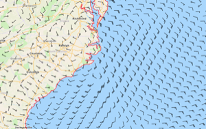
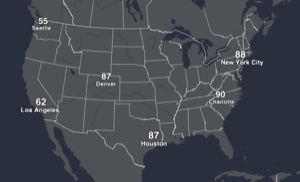
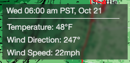

# Wizard Graphics

An extension of of deck.gl along with other mapping tools for numerical weather data.

## Getting Started

This is a monorepo setup using NPM Workspaces. The `/library` directory contains the `@noaa-gsl/wizard-graphics` package and the `/demo` directory contains the examples, which can be run with [Vite](https://vitejs.dev/).

In order for the basemaps to load in the examples, you need an [ESRI API key](https://developers.arcgis.com/documentation/security-and-authentication/api-key-authentication/tutorials/migrate-to-api-key-credentials/). You can either set an environment variable:

```bash
export mapToken=<ESRI_API_KEY>
```

Or set `TOKEN` directly in `main.jsx`. However, this is not recommended.

### To install dependencies:

_**Note:** Following commands are all from the root directory_

1. Install `npm` packages

    ```bash
    npm install
    ```

2. Build the `@noaa-gsl/wizard-graphics` package

    ```bash
    npm run build
    ```

    - This only needs to be done once after cloning the repo. But if any changes are made to files in `/library` that need to be reflected in the demo project, a new build must be created. Alternatively, run the command below to build after every save

    ```bash
    npm run build:dev
    ```

### To run the Vite dev server with examples:

```bash
# root directory or /demo
npm run dev
```

## Layer Documentation

- [ShadedLayer](docs/shaded-layer.md)

      

- [ParticleLayer](docs/particle-layer.md)

      

- [ContourLayer](docs/contour-layer.md)

      

- [VectorLayer](docs/vector-layer.md)

      

- [CitiesLayer](docs/cities-layer.md)

      

- [Readout](docs/readout.md)

      
